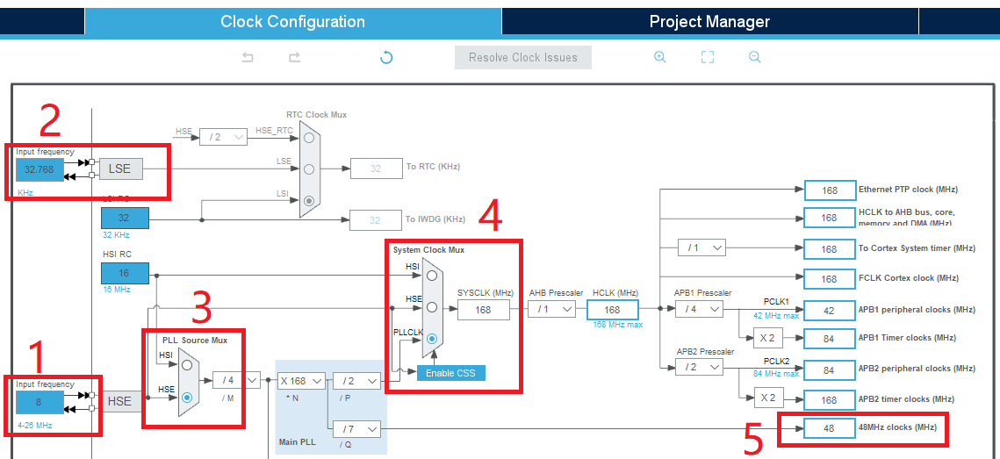
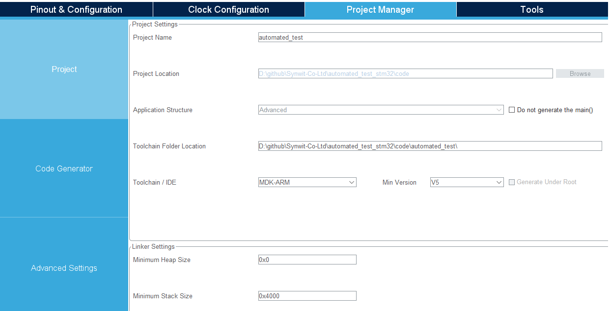
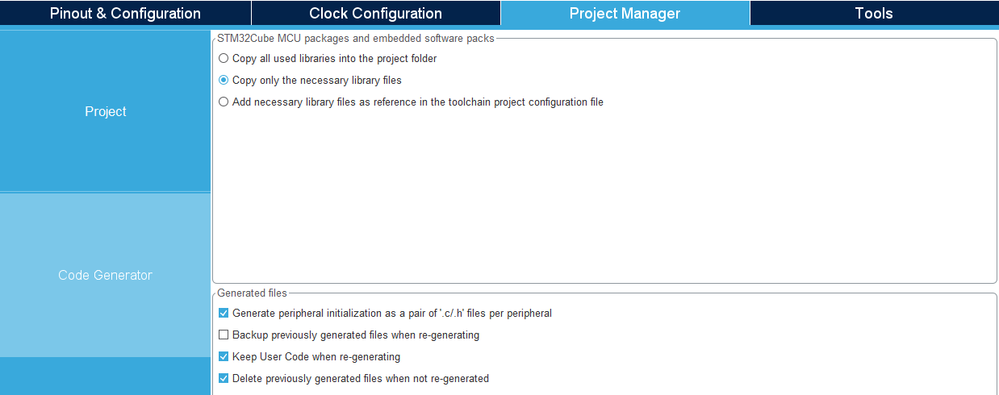

# STM32CubeMX配置

项目通过`STM32CubeMX`配置硬件，生成keil工程。

## Home页配置

打开`STM32CubeMX`，选择`ACCESS TO MCU SELECTOR`。

## Selector页配置

1. 在左侧`MCU/MPU Filters`中搜索`STM32F407ZGT6`。
2. 在中间选择`STM32F407ZGT6`。
3. 点击右上角的`Start Project`创建工程。

## 时钟配置

1. 根据开发板硬件晶振，HSE配置为8MHz。
2. 根据开发板硬件晶振，LSE配置为32.768KHz（因为未使能RTC，所以RTC时钟源为灰色，不能选择）。
3. PLL源选择外部晶振，外部晶振频率更准确，稳定性更好。
4. 系统时钟配置PLL，使用最高频率168MHz。
5. 48MHz时钟为USB时钟源，必须保证为48MHz。

## RCC配置

`HSE`和`LSE`都选择`Crystal/Ceramic Resonator`，使用外部晶振，其他保持默认。

## SYS配置

`Debug`选择`Serial Wire`，使用SWD调试接口，其他保持默认。

## 按键配置

`PA15`配置为输入模式，上拉使能。

## LED配置

`PC13`配置为推挽输出模式，上拉使能，默认输出高电平。

## USART1配置

使能USART1(默认使用PA9/TX,PA10/RX)，模式选择`Asynchronous`。

### 参数设置

波特率设置为9600Bits/s，其他保持默认。

### NVIC设置

使能`USART1 global interrupt`。

### DMA设置

添加`USART1_RX`的DMA请求，各参数保持默认。

## USB配置

使能USB_OTG_FS(默认使用PA11/DM,PA12/DP)，模式选择`Device_Only`，其他保持默认。

## 工程管理

### 工程设置

填写工程名和生成代码要保存的路径，工具链选择`MDK-ARM`，V5版本。

堆大小设置为0，栈大小设置为0x4000。

### 生成代码设置

按如下配置进行设置：
1. 只生成必须的库文件
2. 每个外设生成独立的`.c/.h`文件
3. 重新生成代码时保留用户代码
4. 重新生成代码时删除过时代码

## 生成代码

点击右上角的`GENERATE CODE`即可生成模板代码🛺🛺🛺。